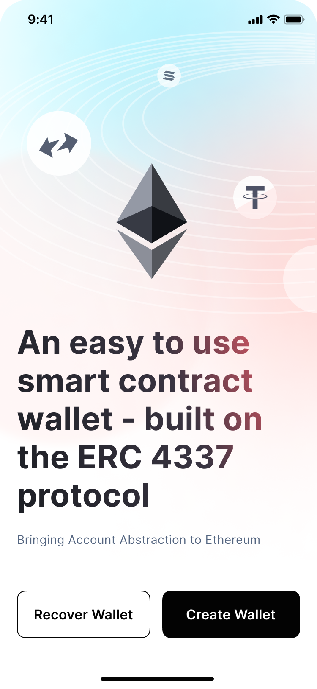

# Create a New Wallet

[Next - Recover Center GuideFor Designers](https://app.gitbook.com/o/lXEOkow8LrPEj07ivybO/s/gXuI2iMBk8UuefNBr22U/\~/changes/6/recover-center-guide/for-designers)Open the BlueWave wallet and choose "Create Wallet".\
.png>)\
Set your login Email. Then check your email from service@BlueWaveWallet.org to get the code.

&#x20;If you do not see the email in a few minutes, check your “junk mail” folder or “spam” folder, or try submitting the request again. If you still don’t receive an email, then write to contact@BlueWaveWallet.org explaining the problem. We will do our best to answer your request as soon as possible.

Input your verification code to continue.&#x20;

.png>)

\
Click "Continue" to set your login password (a minimum of 10 characters).&#x20;

Click “Submit” to complete the process.

\

.png>).png>)

\
